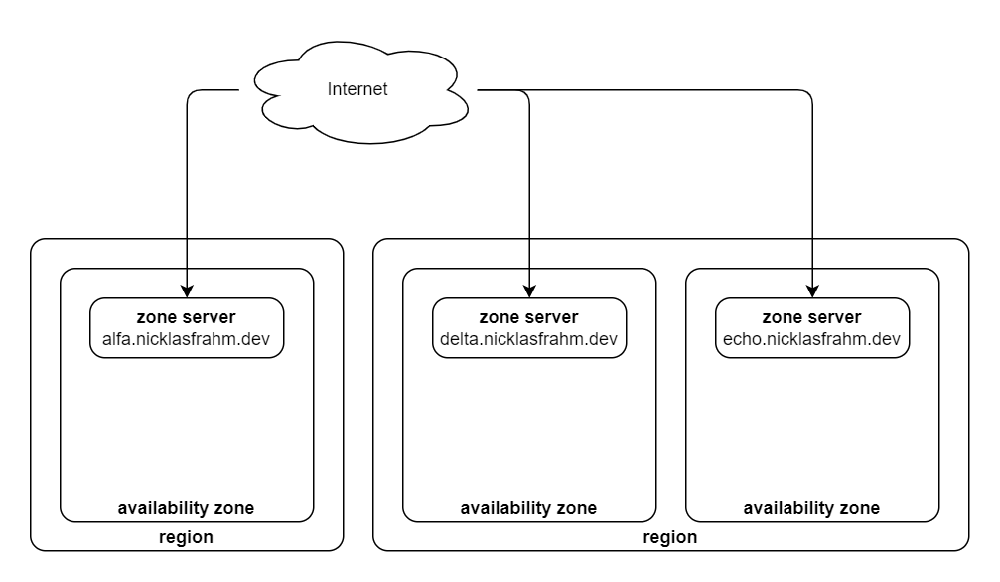

# Regions and zones

This document describes the architecture of availability zones and regions in my personal infrastructure.

## Overview

Each availability zone has a single **zone server**. The zone server serves critical infrastructure services, such as DNS and DHCP, but also acts as a firewall and router for the zone.

A region is a collection of availability zones. Regional services, such as a management API, are served in auto-failover clusters across multiple **zone servers**.

